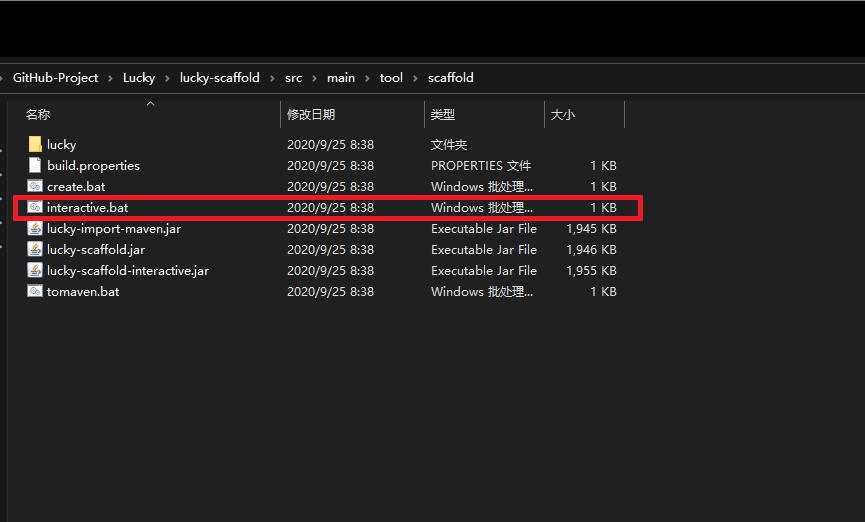
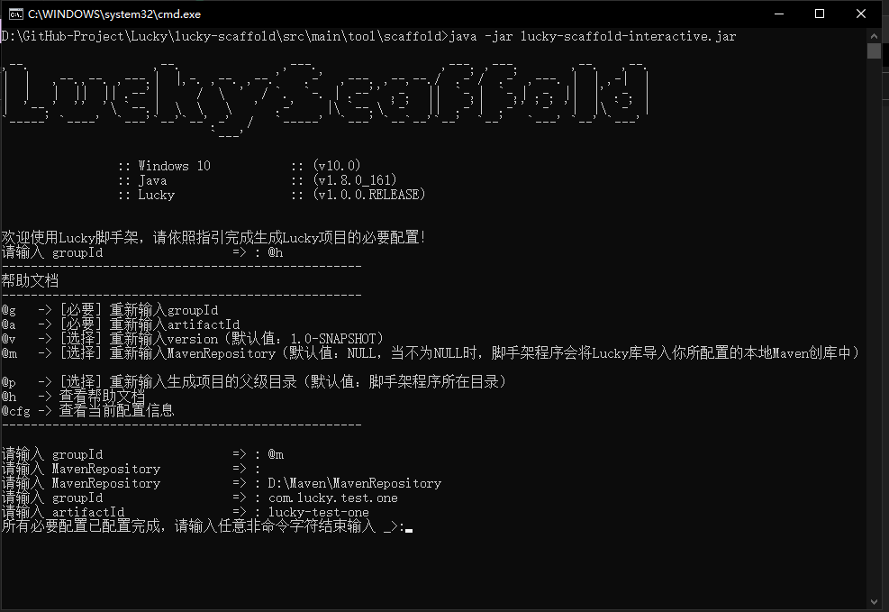
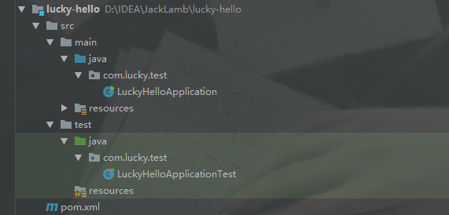
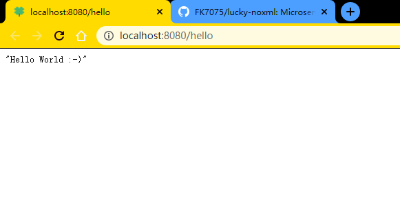

[TOC]

# Lucky使用文档

## 一.Lucky的简介

​		简而言之，言而简之，反正我不喜欢写简介......

## 二.下载安装

### 1.脚手架方式安装

​	**1.1 脚手架的获取方式**

​		a.[百度网盘下载](https://pan.baidu.com/s/1ReCI4BWtPqfs0A9A3l24wg)   提取码：lucy

​		b.[GitHub下载](https://github.com/FK7075/lucky-noxml/)    Code -->Download ZIP

​	 **1.2 脚手架的使用**



​	如图为Lucky脚手架的目录结构(使用GutHub下载方式的可以在 /lucky-scaffold/src/main/tool/中找到这个工具 )  这个脚手架工具的主要功能是帮我们生成一个简单的Lucky项目的目录结构【Maven+IDEA】，如果你是第一次	使用Lucky，那么你需要将Lucky的运行环境导入到你的本地Maven仓库，这个脚手架工具也提供了这个功能！

双击**interactive.bat**你将看到下图中的效果：



```shell
命令介绍
@g    -->  调出groupId配置，用于设置项目的groupId
@a    -->  调出artifactId配置，用于设置项目的artifactId
@v    -->  调出version配置，用于设置项目的version(默认值:1.0-SNAPSHOT)
@m    -->  调出本地Maven仓库地址配置，用于将Lucky运行环境导入本地Maven仓库（默认值：NULL，当不为NULL	            时,脚手架程序在构建项目之前会将Lucky运行环境导入你所配置的本地Maven创库中）
@p    -->  生成项目的存放地址，（默认值：脚手架程序所在目录）
@h    -->  查看帮助文档
@cfg  -->  查看当前配置信息
```

也即当**MavenRepository**配置项**不为NULL**时，脚手架就会帮我们将Lucky运行环境导入你配置的这个地址，脚手架程序运行结束后你顺便还得到了一个简单的Lucky项目。

### 2.编译源码方式安装

不急不急，有空再写........

## 三.Hello World

### 1.创建Maven(Java)项目

**注：以下为手动创建过程，这个工作也可以交给脚手架，只需要按照指引输入正确的groupId、artifactId和version，脚手架程序会也帮我们生成这样一个简单的目录结构，我们只需要在IDEA中打开这个项目即可！**

```xml
<!-- 项目信息 -->
<groupId>com.lucky.test</groupId>
<artifactId>lucky-hello</artifactId>
<version>1.0-SNAPSHOT</version>
```

项目的目录结构如下：




### 2.添加Lucky的依赖

```xml
<!-- Lucky运行环境 -->
<dependency>
    <groupId>com.lucky.jacklamb</groupId>
    <artifactId>lucky</artifactId>
    <version>1.0.0</version>
</dependency>
```

### 3.添加编译插件

```xml
<!-- 编译插件 -->
<plugin>
    <groupId>org.apache.maven.plugins</groupId>
    <artifactId>maven-compiler-plugin</artifactId>
    <configuration>
        <source>1.8</source>
        <target>1.8</target>
        <encoding>UTF-8</encoding>
        <compilerArgs>
            <!-- 添加编译参数-parameters -->
            <arg>-parameters</arg>
        </compilerArgs>
    </configuration>
</plugin>
```

### 4.添加打包插件

```xml
<!-- 打包插件1 -->
<plugin>
    <groupId>org.apache.maven.plugins</groupId>
    <artifactId>maven-dependency-plugin</artifactId>
    <version>3.0.1</version>
    <executions>
        <execution>
            <id>copy-dependencies</id>
            <phase>package</phase>
            <goals>
                <goal>copy-dependencies</goal>
            </goals>
            <configuration>
                <outputDirectory>${project.build.directory}/lib</outputDirectory>
                <overWriteReleases>false</overWriteReleases>
                <overWriteSnapshots>false</overWriteSnapshots>
                <overWriteIfNewer>true</overWriteIfNewer>
            </configuration>
        </execution>
    </executions>
</plugin>

<!--打包插件，用于将应用打包为可运行的Jar包-->
<plugin>
    <groupId>org.apache.maven.plugins</groupId>
    <artifactId>maven-assembly-plugin</artifactId>
    <version>3.0.0</version>
    <configuration>
        <archive>
            <manifest>
                <!-- 主函数所在类 -->
                <mainClass>xxx.xxx.XXXMainClass</mainClass>
            </manifest>
        </archive>
        <descriptorRefs>
            <descriptorRef>jar-with-dependencies</descriptorRef>
        </descriptorRefs>
    </configuration>
    <executions>
        <execution>
            <id>make-assembly</id>
            <phase>package</phase>
            <goals>
                <goal>single</goal>
            </goals>
        </execution>
    </executions>
</plugin>
```

### 5.编写启动类LuckyHelloApplication

Lucky启动类的作用和SpringBoot的启动类的作用相同，作用同为启动内嵌的Web服务器，初始化IOC容器，完整自动注入等工作.....（启动类必须写在最外层的包下）

```java
package com.lucky.test;
import com.lucky.jacklamb.start.LuckyApplication;

/**
 * 启动类
 */
public class LuckyHelloApplication {

    public static void main( String[] args ) {
        LuckyApplication.run(LuckyHelloApplication.class,args);
    }
}
```

### 6.编写HelloController

```java
package com.lucky.test.controller;

import com.lucky.jacklamb.annotation.ioc.Controller;
import com.lucky.jacklamb.annotation.mvc.GetMapping;
import com.lucky.jacklamb.enums.Rest;

@Controller(rest = Rest.JSON)
public class HelloController {
    
    @GetMapping("hello")
    public String hello(){
        return "Hello World :-)";
    }
    
}
```

到此为止，Lucky的HelloWorld就已经编写完成，接下来运行启动类中的Main方法，打开浏览器访问[localhost:8080/hello](http://localhost:8080/hello)便可以看到运行效果！



## 四.Lucky组件介绍

在开发中，Lucky允许用户定义一下种组件，不同组件定义不同的功能块，不同组件之间通过IOC容器进行调度与组合。

1. **AppConfig组件**：用于修改默认约定和运行时的某些参数。
2. **Controller组件**：用于接收和响应Http请求。
3. **Service组件**：用于处理业务逻辑。
4. **Repository组件**：使用传统方式与数据持久层交互。
5. **Mapper组件**：使用Mapper接口方式与数据持久层交互
6. **Component组件**：普通的ioc组件。
7. **Aspect组件**：aop组件，用于定义一系列的增强，用于功能的横向扩展。
8. **WebSocket组件**：WebSocket组件，用于定义一个接受webSocket请求的组件
9. **ControllerExceptionHandler**：异常处理组件，用于处理由Controller组件所产生的异常
10. **Configuration**：配置解析与Bean注册
11. **QuartzJobs**:定义一组定时任务组件

## 五.Lucky的两种约定

### 1.自动扫描约定(默认)

​	自动扫描约定是一种十分宽泛的约定，lucky启动时会自动扫描项目路径中的所有文件来得到并管理用户创建的各大组件，自动完成依赖注入以及动态代理等工作，用户只需要按照规定定义好组件既可以立即使用，在此模式下不需要使用以往大量的xml配置，也没有任何其他要求！一切自然而然的简单！

### **2.后缀扫描约定**

相比**自动扫描约定**这个**后缀扫描约**多了些许的条件限制，在这种约定模式下，指定的组件需要编写在指定的位置，这样才能确保Lucky在启动的时候能够准确的找到并启用他们。在**后缀扫描约定**中**各大组件必须写在**以特定名字结尾的包中才能被Lucky识别。

以下是各大组件在**后缀扫描模式**下的默认约定位置：

|           组件名称            |                     约定位置                      |                        配合使用的注解                        |                约定位置举例说明                 |
| :---------------------------: | :-----------------------------------------------: | :----------------------------------------------------------: | :---------------------------------------------: |
|         **AppConfig**         |                     任意位置                      |                      @AppConfig注解标注                      |                    任意位置                     |
|        **Controller**         |       定义在包名以**controller**结尾的包中        |                     @Controller注解标注                      |  【*controller】controller，com.mycontroller等  |
|          **Service**          |         定义在包名以**service**结尾的包中         |                       @Service注解标注                       |  【*service】service，com.lucky.testservice等   |
|        **Repository**         | 定义在包名以【**repository**或**dao**】结尾的包中 |                     @Repository注解标注                      |             【*repository和 *dao】              |
|          **Mapper**           |         定义在包名以**mapper**结尾的包中          |                       @Mapper注解标注                        |                   【*mapper】                   |
|         **Component**         | 定义在包名以【**component**或**bean**】结尾的包中 |                      @Component注解标注                      | 【*component或 *bean】com.bean,com.component等  |
|          **Aspect**           |     定义在包名以**aspect**或**aop**结尾的包中     |                        @Agent注解标注                        | 【*aspect, *aop】com.aop,com.lucky.testaspect等 |
| **ControllerExceptionHander** |    定义在包名以**exceptilonhandle**r结尾的包中    | @ControllerExceptionHander注解标注，并继承LuckyExceptionHand |              【*exceptionhandler】              |
|         **WebSocket**         |          定义在包名以websocket结尾的包中          |                    使用Tomcat中的编写规范                    |                 【*websocket】                  |

## 四.Lucky的配置文件和配置类


